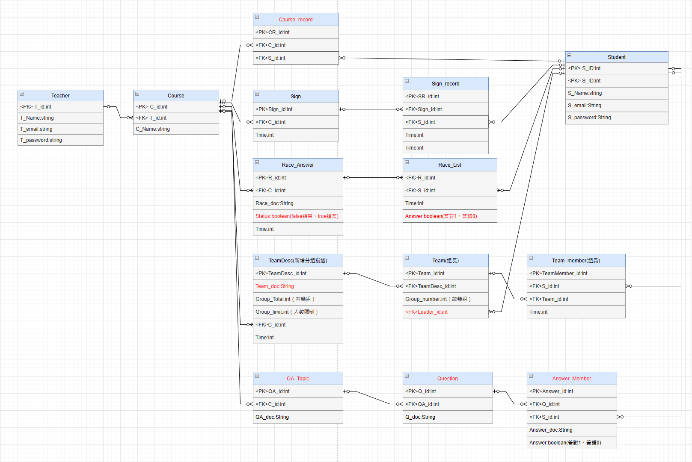

# McyangBackEnd_DockerVersion
## 1. 项目介绍
這是一個基於Docker的後端服務器，使用Django作為後端框架，使用MariaDB作為資料庫，使用Docker Compose作為容器管理工具。
這個專案是"情境劇本Beacon互動教學工具"的後端服務器，用於提供手機應用程式的API。

學生端APP: https://github.com/NakiriYuuzu/New_McyangStudent

老師端APP: https://github.com/NakiriYuuzu/New_McyangTeacher

## 1.1 App Doc
請參考 [点击访问 Documentation](documentation/doc/html/index.html)
/documentation/doc/html/index.html

## 1.2 APP 畫面
https://www.youtube.com/watch?v=iIz-snOuN9g
https://www.youtube.com/watch?v=zx3Sb4nhOCA
https://www.youtube.com/watch?v=2g1UoQAVO0U

---
## 2. 项目结构
### 2.1 API
請參考 https://blog.csdn.net/Carrie_Q/article/details/117811425

    1. 打開Postman匯入documentation/api/McyangAPI.postman_collection.json
    2. 選擇McyangAPI
    3. 選擇API然後選擇送出就可以測試API

### 2.2 資料庫設計


### 2.3 使用案例圖


### 2.4 循序圖


### 2.5 系統架構圖
```angular2html
    +-----------------------+
    |       App Client      |
    +-----------------------+
    |                       |
    |  +-----------------+  |
    |  |   Websocket     |<--------------------+
    |  +-----------------+  |                   |
    |                       |                   |
    |  +-----------------+  |                   |
    |  |     REST API    |<--------+            |
    |  +-----------------+  |     |            |
    |                       |     |            |
    |  +-----------------+  |     |            |
    |  |     Beacon      |  |     |            |
    |  +-----------------+  |     |            |
    |                       |     |            |
    |  +-----------------+  |     |            |
    |  |  Firebase Chat  |  |     |            |
    |  +-----------------+  |     |            |
    +-----------------------+     |            |
                                   |            |
                                   |            |
    +-----------------------+     |            |
    |    Django Backend     |     |            |
    +-----------------------+     |            |
    |                       |     |            |
    |  +-----------------+  |     |            |
    |  | Websocket Views |  |     |            |
    |  +-----------------+  |<----+            |
    |                       |                   |
    |  +-----------------+  |                   |
    |  |  API Views      |  |<------------------+
    |  +-----------------+  |
    |                       |
    +-----------------------+
                |
                |
    +-----------------------+
    |      MariaDB (DB)     |
    +-----------------------+

```

---
## 3. 项目部署
```bash
# 1. Git clone项目
git clone https://github.com/NakiriYuuzu/McyangDockerServer.git

# 2. 安装 docker & docker-compose
sudo chmod +x McyangDockerServer/documentation/bash/install_docker.sh
McyangDockerServer/documentation/bash/./install_docker.sh

# 3. 重新啓動
sudo reboot

# 4. 进入项目目录
cd McyangDockerServer

# 5. Docker-Compose 指令
docker-compose up --build                                         # 启动项目與視窗
docker-compose up -d --build                                      # 启动项目與背景執行

docker-compose down                                               # 停止项目

docker-compose exec web python manage.py createsuperuser          # 創建超級用戶

docker-compose exec [請看docker-compose.yml 内容有 db 和 web] bash  # 進入容器
docker-compose ps                                                # 查看容器狀態
```

### 如啓動失敗，請在啓動一次